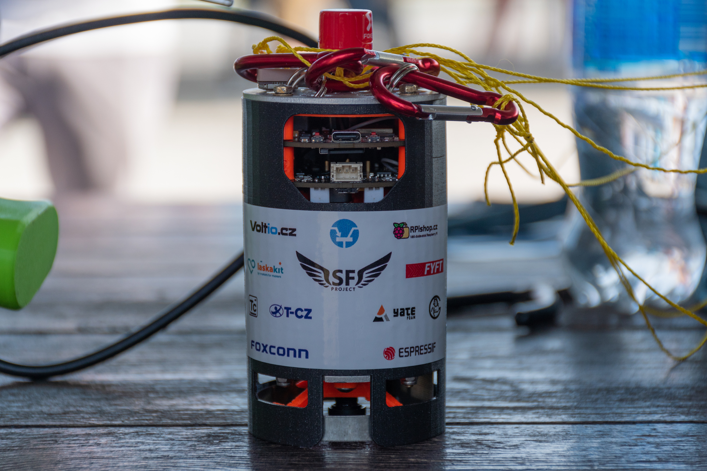
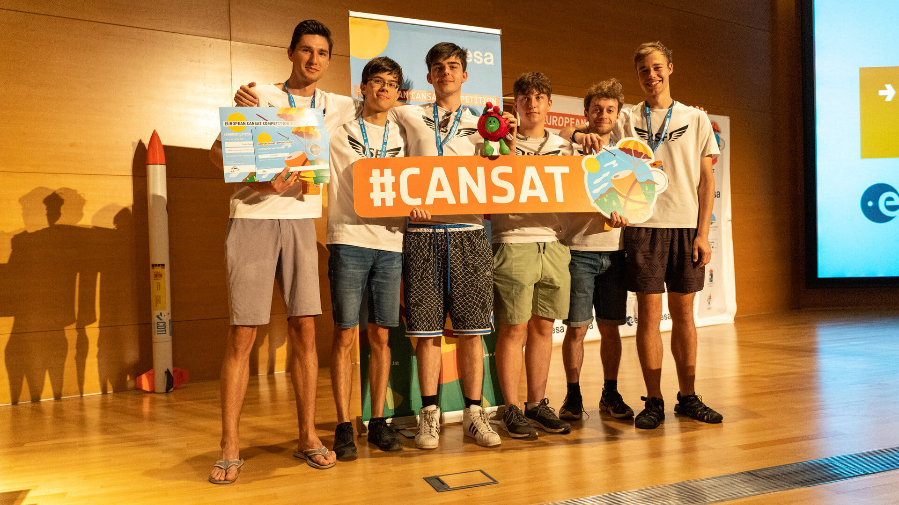
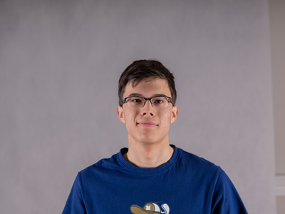
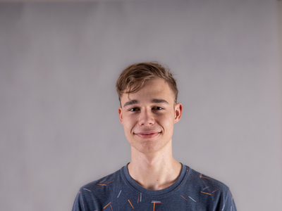
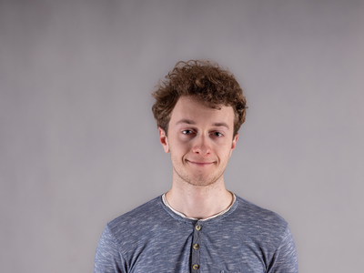
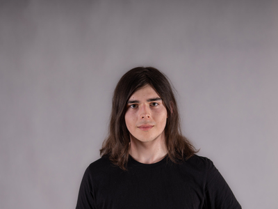
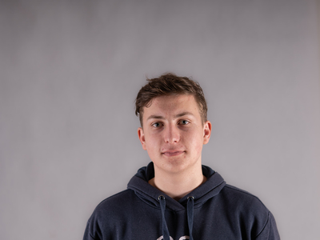
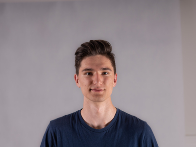

# Disclaimer
This README isn't finished and will be edited in near future

# CanSat-2023
This is a repository of the Czech CanSat team Project SkyFall, winner of CanSat's 2023 Czech national round

  

## Documentation

<!-- About team -->

## About the team

  

  ### Vít Brázda
  <table><tr>
    <td width="250"></td>
    <td>Vít is responsible for data visualization running on ground station, as well as making index of habitability of planet, where CanSat is landing. He has a lot of experience regarding Python.</td>
  </tr></table>

  ### David Haisman
  <table><tr>
    <td width="250"></td>
    <td>David handles electronics and programming on our CanSat. He designed PCB's, made some libraries and wrote the whole CanSat code. During the development of the CanSat he gained a lot of experience regarding PCB design and programming in C++.</td>
  </tr></table>

  ### Radim Leština
  <table><tr>
    <td width="250"></td>
    <td>Radim is in charge of designing the outer construction of the CanSat itself. He has a lot of experience in designing and 3D printing mechanical contraptions.</td>
  </tr></table>

  ### Václav Horáček
  <table><tr>
    <td width="250"></td>
    <td>Václav is in charge of multiple departments, mainly the ones for documentation and recovery. In documentation he made the styles, graphics and oversees the documentation making process. His contribution in the recovery department is designing and sewing the CanSat's parachute.</td>
  </tr></table>

  ### Lukáš Nastoupil
  <table><tr>
    <td width="250"></td>
    <td>Lukáš designed and made the ground station, which is an essential part for our secondary mission. He designed the PCB's, modeled and programmed the ground station. He also worked on the real-time transmission of video from CanSat down to the ground station.</td>
  </tr></table>

  ### Adam Keřka
  <table><tr>
    <td width="250"></td>
    <td>Adam leads the team itself and also the department of publicity. This mainly includes maintaining social networks accounts and communicating with sponsors. He also designed a lot of the graphics used in advertising and posts on social networks.</td>
  </tr></table>

  ### Vladimír Kašpar
  Ing. Vladimír Kašpar is our mentor in the CanSat competition. We chose Vladimír Kašpar as our mentor based on his experience. In the CanSat 2019 he was a mentor of team Charles the fourth that made it to the European finale. He is also an electronics teacher at SPŠE a VOŠ Pardubice.

  ### Jan Novotný
  Jan Novotný is a freelance developer who makes web and mobile applications. He programmed the Project SkyFall webpage and supports our team on various other competitions and outgoings.
